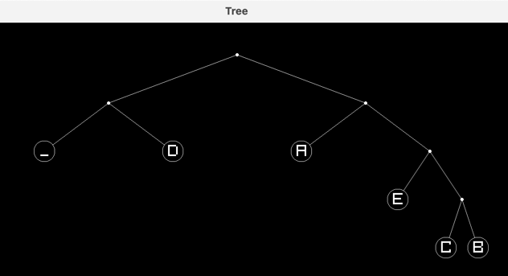

# Huffman encoding
This program will generate a Huffman encoding for a piece of text and then decode the compressed text, returning to the original values

## Example Usage
``` console
$ python3 huffman.py
RAYLIB STATIC 5.0.0.4 LOADED
{'B': '1111', 'C': '1110', 'E': '110', 'A': '10', 'D': '01', '_': '00'}
length of raw: 368; length of encoded: 115

Decoded: A_DEAD_DAD_CEDED_A_BAD_BABE_A_BEADED_ABACA_BED
Original text length: 46 chars (368 bits)
 Encoded text length: 115 bits
 Decoded text length: 46 chars
   Compression ratio: 31.25 %
```

### Huffman encoding tree
